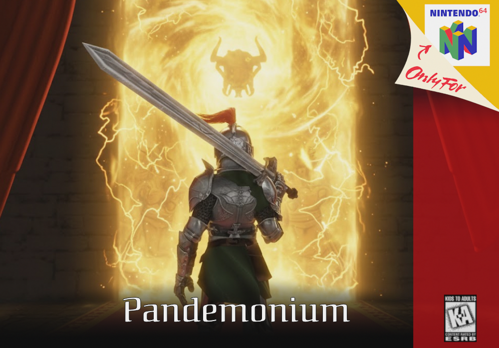
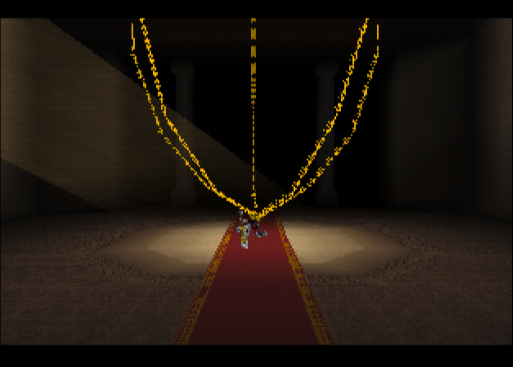
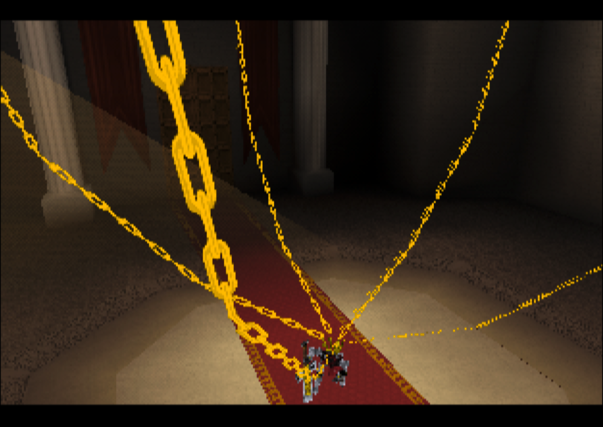
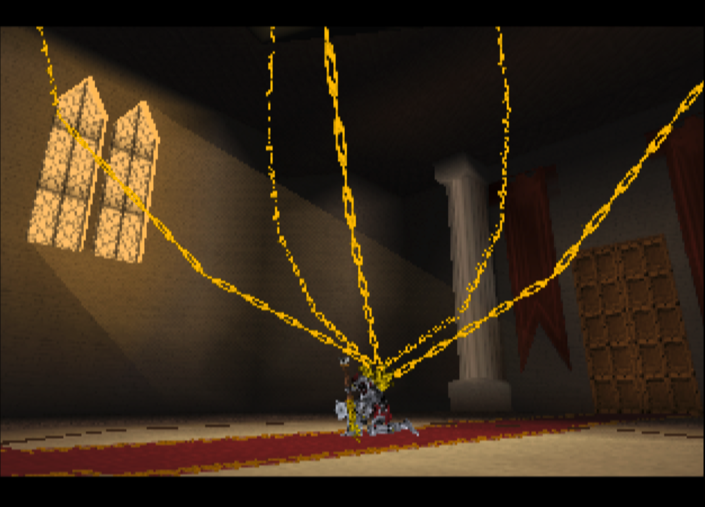

# Pandemonium

## Story
A century of darkness smothers the land beneath the Demon King’s throne of gold, guarded by knights that were reduced to hollow armor. You are one of them, cursed into a horrific form as you push through a ruined kingdom. Pandemonium is a dark-fantasy action-adventure platformer. Prevail and the restored ones whisper a final command—free the sun.

## Controls
Stick: Move
A button: Dodge
B button: Attack
C-Pad: Look
Z trigger: Pause Menu

## 2025 N64brew Game Jam - Pandemonium
- December 1st - Feburary 1st
- Theme Annonced on December 8th
- Theme: Repair
- We are going for a fully fleshed out boss battle. Similar to a dark souls or Majoras Mask battle. Weaving in the theme of repair into the boss. 

## Features:
- Souls-Like Boss AI with many different attacks and animations.
- A character controller with many different animation states, with lock-on mechanism.
- A weapon collision system that can use a mix of different types of colliders.
- A real-time cinematic cutscene.
- Another cutscene that plays as a video.
- Uses 32 bit framebuffer for cleaner graphics.
- A distance-based SFX system.
- Weapon streaks & a few different feedback systems.
- Dialog system.
- Almost entirely 64x64 textures with vertex colors for higher res.
- Assets & Music from scratch for the jam. (or heavily modified)
- Scrolling textures on a skinned mesh.

## Jam Gam Requirements (simplified version)
- 1 project submission only
- Must work on PAL/NTSC system. Optionally tested on emulator
- Max 5 members to a team
- Any N64 SDK is allowed (libultra/librdragon/etc)
- Game source must be open source in perpetuity
- Game code must mostly be from the team
- Third party assets allowed but must provide credit
- Must be playable, no visual or audio demos

## Screenshots

## Build
- Install libdragon (preview)
- Install Tiny3D (main)
- run make file

### Team Members 
BoxingBruin:
- Github: BoxingBruin
- Discord: BoxingBruin
- Bluesky: boxingbruin.bsky.social
- Mastodon: @BoxingBruin

HelloNewman:
- Github: HellooooNewman
- Discord: HelloNewman

## Licensing

- Code is licensed under GPLv3. See LICENSE.
- For all non-code assets, including images, music & 3D models. See LICENSE_ASSETS.
