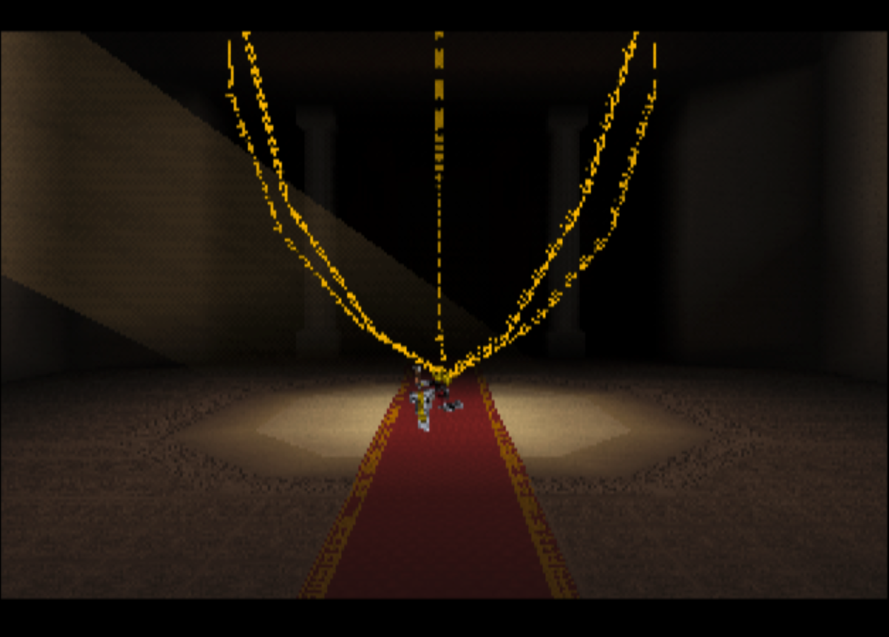
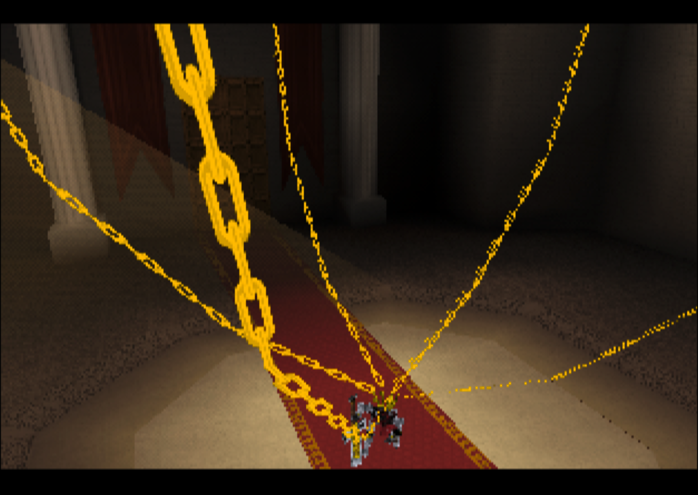
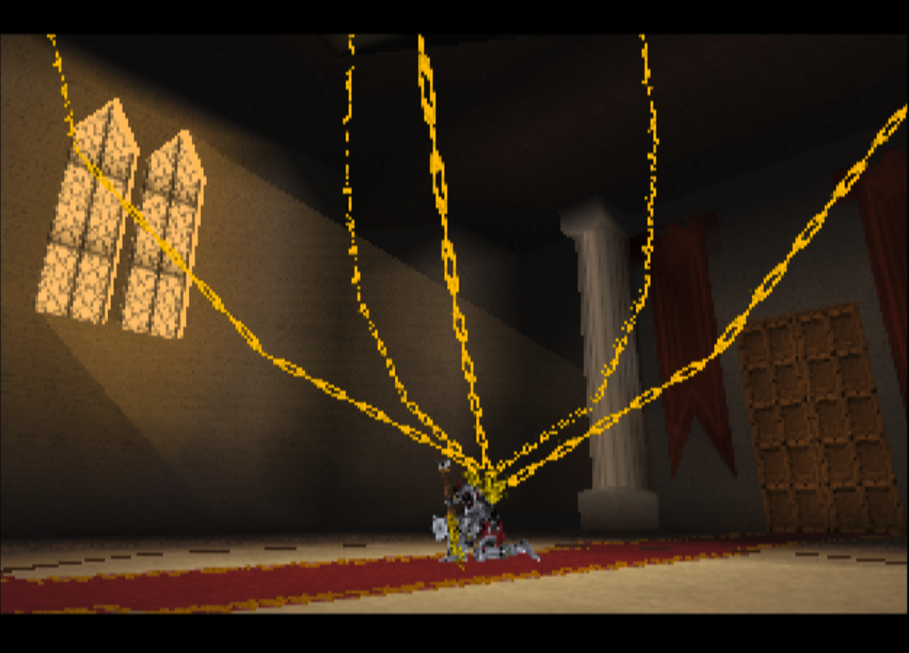

# Pandemonium

## Story
A century of darkness smothers the land beneath the Demon King’s throne of gold, guarded by knights reduced to hollow armor. You are one of them, cursed into this form and forced to bend to the kings will. Pandemonium is a dark-fantasy action-adventure platformer.

## Controls
Stick: Move

A button: Dodge

B button: Attack

C-Pad: Look

Start button: Pause Menu

Z trigger: Toggle z targetting

Hold Z trigger + left/right on Cpad: Change z target

## 2025 N64brew Game Jam - Pandemonium
- December 1st - Feburary 1st
- Theme Annonced on December 8th
- Theme: Repair
- We are going for a fully fleshed out boss battle. Aesthetic and mechanics of Elden Ring. Weaving in the theme of repair into the boss. 

## Features:
- Souls-Like Boss AI with many different attacks and animations.
- A character controller with many different animation states, with lock-on mechanism.
- A weapon collision system that can use a mix of different types of colliders.
- A real-time cinematic cutscene.
- Another cutscene that plays as a video.
- Uses 32 bit framebuffer for cleaner graphics.
- A distance-based SFX system.
- Weapon streaks & a few different feedback systems.
- Dialog system.
- Almost entirely 64x64 textures with vertex colors for higher res.
- Assets & Music from scratch for the jam. (or heavily modified)
- Scrolling textures on a skinned mesh.

## Jam Gam Requirements (simplified version)
- 1 project submission only
- Must work on PAL/NTSC system. Optionally tested on emulator
- Max 5 members to a team
- Any N64 SDK is allowed (libultra/librdragon/etc)
- Game source must be open source in perpetuity
- Game code must mostly be from the team
- Third party assets allowed but must provide credit
- Must be playable, no visual or audio demos

## Screenshots

## Build
- Install libdragon (preview)
- Install Tiny3D (main)
- run make file

## SummerCart64

Deploy to a [SummerCart64](https://github.com/Polprzewodnikowy/SummerCart64) over USB using [sc64deployer](https://github.com/Polprzewodnikowy/SummerCart64/releases). Connect the cart in developer / USB upload mode so `sc64deployer list` succeeds.

**Makefile (builds `pandemonium.z64` first, then uploads):**

- `make deploy` — direct ROM upload to the cart (EEPROM4K save type; optional `--save` via env below).
- `make upload-sd` — copy `pandemonium.z64` to the microSD path `Games/Homebrew/Pandemonium.z64` (override with `SC64_SD_DEST`).
- `make sc64-bootloader` — run `sc64deployer reset` so the cart returns to normal bootloader / power-up behavior.

**Scripts (same behavior; use `--no-build` if you already have `pandemonium.z64`):**

- `./scripts/deploy.sh` — build + deploy, or `./scripts/deploy.sh --no-build`
- `./scripts/upload-sd.sh` — build + SD copy, or `./scripts/upload-sd.sh --no-build`
- `./scripts/upload-sd.sh --reset-first` — if the SD is locked by the N64, reset first then upload (also resets cart config)
- `./scripts/sc64-bootloader.sh` — reset only (equivalent to `make sc64-bootloader`)

**Environment:**

- `SC64_DEPLOYER` — path to the `sc64deployer` binary, or to the extracted release folder containing it (otherwise `sc64deployer` on `PATH`).
- `SC64_SAVE` — if set, passed to deploy as `--save` (preserve EEPROM across uploads), e.g. `SC64_SAVE=./pandemonium.eep`.
- `SC64_EXTRA_ARGS` — extra deployer flags (space-separated), e.g. `SC64_EXTRA_ARGS="--direct"`.
- `SC64_SD_DEST` — destination path on SD for `upload-sd` (default: `Games/Homebrew/Pandemonium.z64`).

## Creating a release (GitHub)
- **Bump version**: update `VERSION`, commit, and push.
- **Build the versioned ROM**:
  - `make clean && make versioned`
  - Produces: `Pandemonium-$(cat VERSION).z64`
- **Tag the release**:
  - `git tag -a "v$(cat VERSION)" -m "v$(cat VERSION)"`
  - `git push && git push --tags`
- **Publish on GitHub**: GitHub → *Releases* → *Draft a new release* → select tag `vX.Y.Z` → attach `Pandemonium-X.Y.Z.z64` → *Publish release*.

## Team Members 
BoxingBruin:
- Github: BoxingBruin
- Discord: BoxingBruin
- Bluesky: boxingbruin.bsky.social

HelloNewman:
- Github: HellooooNewman
- Discord: HelloNewman

## Licensing

- Code is licensed under GPLv3. See LICENSE.
- For all non-code assets, including images, music & 3D models. See LICENSE_ASSETS.
